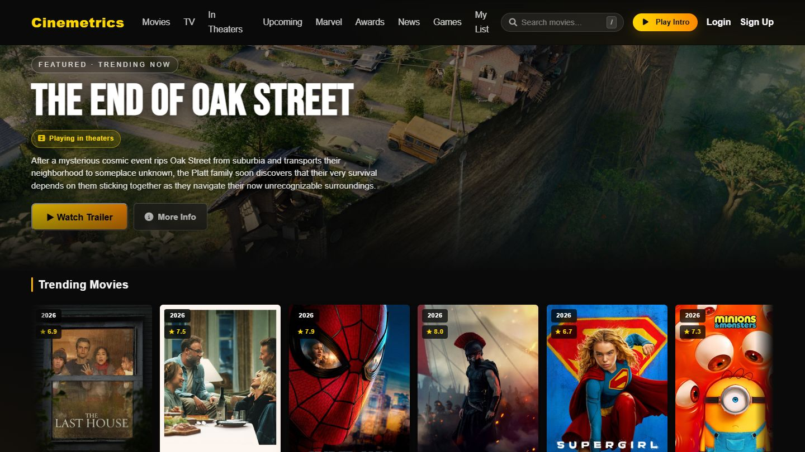
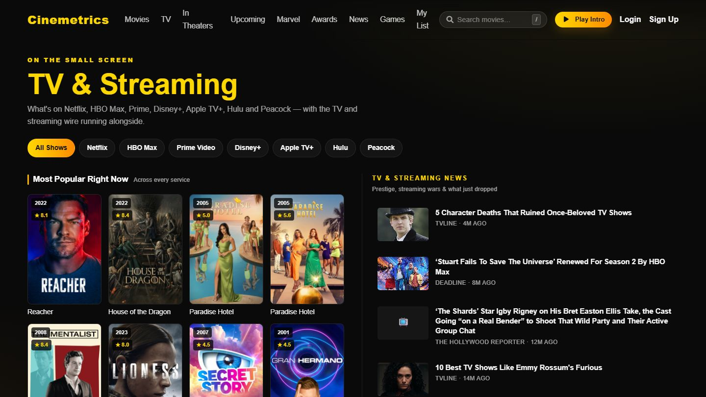
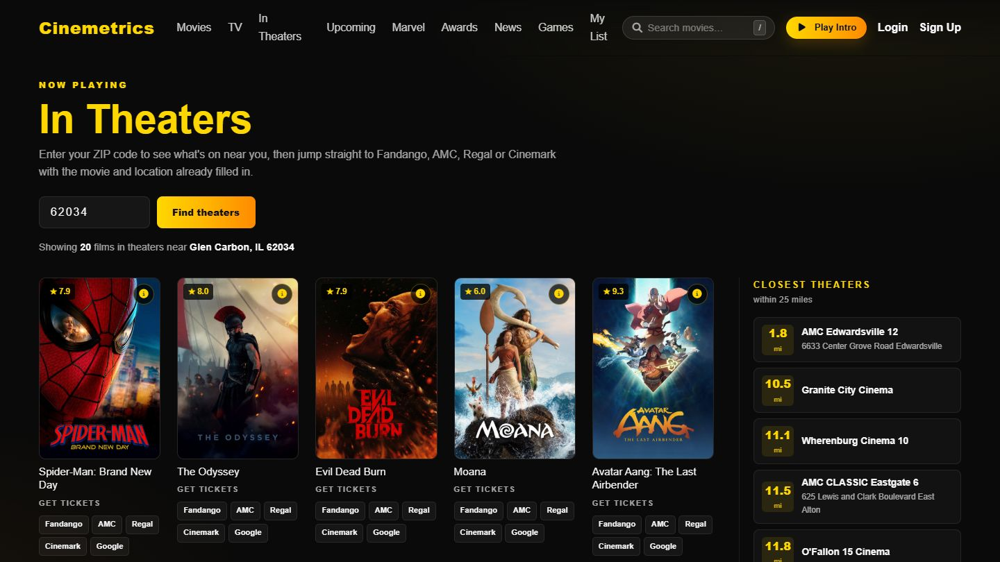
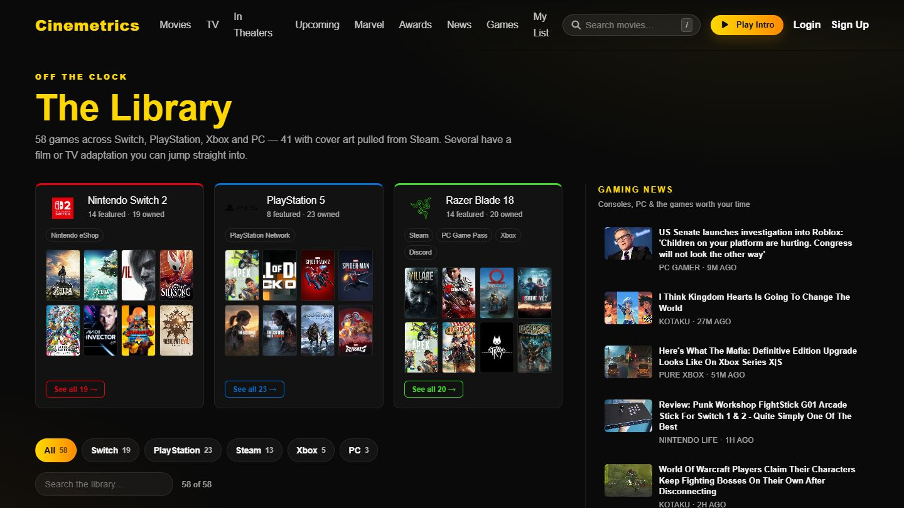
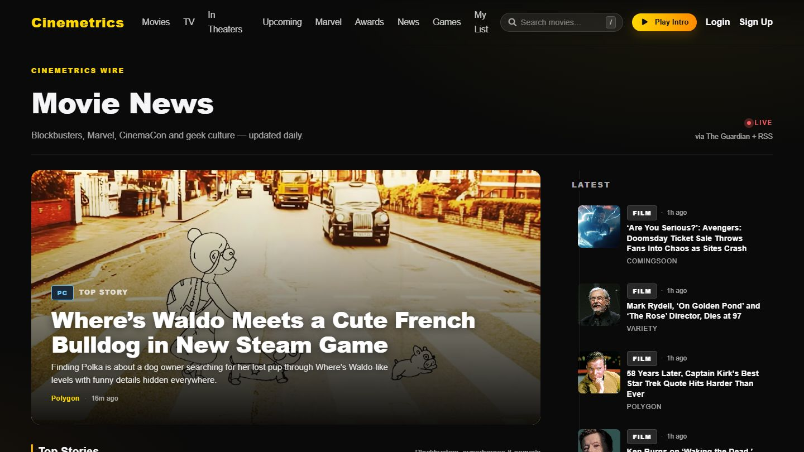
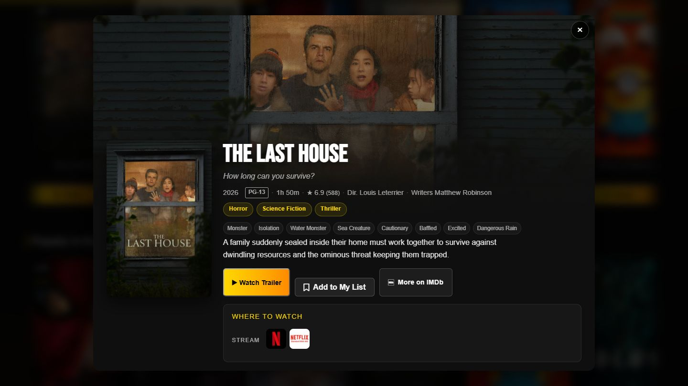
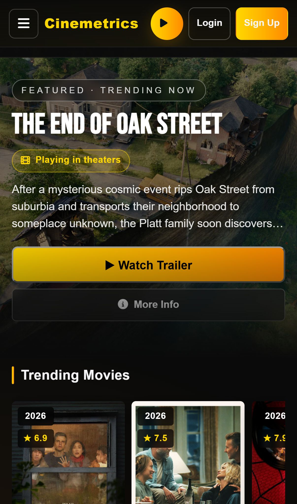
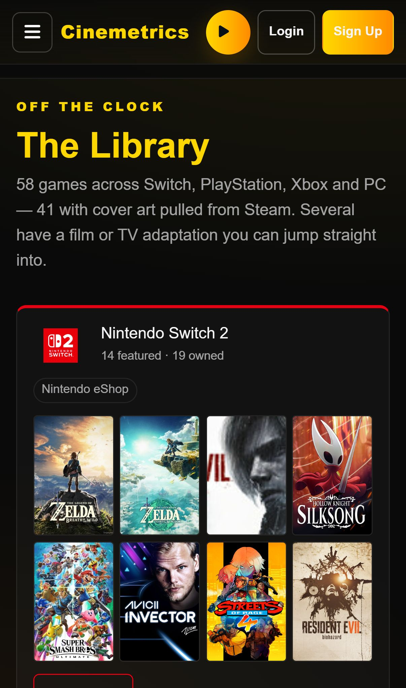

<div align="center">

# 🎬 Cinemetrics

**A cinematic movie, TV, and gaming discovery app — built from scratch with vanilla JavaScript.**

No React. No framework. Native ES modules, a hand-rolled component layer, and an Express API.

[](https://capstonesavvycoders.netlify.app/)
[](https://capstonesavvycoders.netlify.app/)
[](https://capstonesavvycoders.onrender.com/status)


<br />



</div>

---

## What it does

Cinemetrics pulls live data from **TMDB**, **12 news outlets**, and **OpenStreetMap** into one place — what's trending, what's in theaters near you, what's on Netflix, and what's worth playing.

|  | |
|---|---|
| 🎞️ **Movies** | Trending, popular and top-rated, with genre / year / rating / sort filters |
| 📺 **TV & Streaming** | Browse by service — Netflix, HBO Max, Prime, Disney+, Apple TV+, Hulu, Peacock |
| 🎟️ **In Theaters** | Enter a ZIP → what's playing + the closest cinemas within 25 miles |
| 🦸 **Marvel** | The full MCU, grouped by phase with cinematic per-phase heroes |
| 🏆 **Awards** | Oscars across six categories, enriched with TMDB data |
| 📰 **News** | 12 outlets, deduped and balanced so no single wire dominates |
| 🎮 **Games** | A personal library with cover art — and links to each title's screen adaptation |
| 🔖 **My List** | Watchlist saved to `localStorage`, no account required |

---

## Screenshots

<table>
<tr>
<td width="50%"><br /><sub><b>TV & Streaming</b> — browse by service, news rail alongside</sub></td>
<td width="50%"><br /><sub><b>In Theaters</b> — ZIP lookup, ticket links, nearest cinemas</sub></td>
</tr>
<tr>
<td width="50%"><br /><sub><b>The Library</b> — game collection with per-console rigs</sub></td>
<td width="50%"><br /><sub><b>News</b> — magazine layout across 12 sources</sub></td>
</tr>
<tr>
<td colspan="2"><br /><sub><b>Detail modal</b> — certification, cast, crew, where to watch, and scored reviews</sub></td>
</tr>
</table>

<div align="center">


<br />
<sub>Verified on 11 devices — iPhone 15/16/17, Pixel 8/9/10, Galaxy S24, Z Flip 7, Z Fold 7</sub>
</div>

---

## Things I'm proud of

**⚡ 9.9 seconds → 5 milliseconds.** The Marvel and Awards pages each fanned out to dozens of TMDB calls on *every* request. A response-cache middleware that taps `res.json` — so no route handler changed — plus a boot-time warm-up:

| Route | Before | After |
|---|---|---|
| `/movies/marvel` | 9866 ms | **5 ms** |
| `/movies/awards` | 8143 ms | **2 ms** |
| `/movies/upcoming-curated` | 2358 ms | **1 ms** |

**🖼️ No more blank screens.** The router used to `await` every fetch before rendering, so slow routes showed an empty white page. Now the chrome and a shimmer skeleton paint first — Awards went from a 5.2 s blank screen to **first paint at 191 ms**.

**🔍 Every news feed verified before shipping.** 30 candidate RSS feeds were tested against the live parser. The ones that 404'd, paywalled, timed out, or had gone stale are recorded in `REJECTED_FEEDS` with the reason, so nobody re-adds a dead source. A per-outlet cap keeps high-volume wires from crowding out slower ones.

**🎟️ Showtimes without a paid API.** No free showtimes API exists — Fandango has none, Gracenote wants a paid account. So Cinemetrics resolves the ZIP through Zippopotam, finds real cinemas via OpenStreetMap's Overpass API, and deep-links into Fandango/AMC/Regal/Cinemark with the movie and location pre-filled. On mobile those are universal links, so they open the chain's native app.

---

## Tech stack

**Frontend** — Vanilla JS (ES modules) · [Navigo](https://github.com/krasimir/navigo) routing · `html-literal` templating · Parcel · hand-written CSS (no framework)

**Backend** — Node + Express · Mongoose/MongoDB Atlas · JWT auth · `rss-parser` · in-memory TTL cache

**Data** — [TMDB](https://www.themoviedb.org/) · [The Guardian](https://open-platform.theguardian.com/) · 11 RSS feeds · [Zippopotam](https://zippopotam.us/) · [OpenStreetMap Overpass](https://overpass-api.de/)

```
├── index.js          # router, state wiring, modals, event delegation
├── views/            # one module per page, returns an HTML string
├── store/            # per-view state objects
├── components/       # header, nav, main, footer
├── services/api.js   # every backend call in one place
└── server/
    ├── app.js        # express app + middleware
    ├── routes/       # movies, tv, news, person, comments, auth
    ├── controllers/  # curated Marvel / Oscars / upcoming data
    └── utils/cache.js
```

---

## Run it locally

**Requires** Node 16+ and a [TMDB API key](https://www.themoviedb.org/settings/api) (free).

```bash
git clone https://github.com/jamesmnguyen704/CapstoneSavvyCoders.git
cd CapstoneSavvyCoders
npm install
```

Create `.env` in the project root:

```bash
TMDB_API_KEY=your_tmdb_key          # required
TMDB_ACCESS_TOKEN=your_tmdb_token   # required for some routes
MONGODB=your_mongodb_uri            # required for auth + comments
JWT_SECRET=dev_secret_change_me
BACKEND_PORT=3000
GUARDIAN_API_KEY=                   # optional, falls back to a rate-limited test key
RESEND_API_KEY=                     # optional, welcome emails
EMAIL_FROM=you@example.com
```

Two terminals:

```bash
npm run app:watch   # API on :3000 (nodemon)
npm start           # frontend on :1234
```

Open **http://localhost:1234**.

> ⚠️ Don't run `npm run build` while the dev server is running — they share
> `.parcel-cache`, and the dev server will silently serve a stale bundle.

| Script | Does |
|---|---|
| `npm start` / `npm run dev` | Parcel dev server on `:1234` |
| `npm run server` | API once (`node server/start.js`) |
| `npm run app:watch` | API with nodemon |
| `npm run build` | Production build to `dist/` |
| `npm run seed` | Seed test data |

---

## API

Base: `https://capstonesavvycoders.onrender.com`

| Endpoint | Returns |
|---|---|
| `GET /status` | Health + cache stats |
| `GET /movies/trending` · `/popular` · `/top_rated` · `/now_playing` | Movie lists |
| `GET /movies/discover` | Filter by genre, year, rating, sort |
| `GET /movies/:id/details` | Full detail — cast, crew, keywords, certification, reviews, providers |
| `GET /movies/marvel` · `/awards` · `/upcoming-curated` | Curated, cached |
| `GET /movies/in-theaters?zip=` | Now playing + ticket links |
| `GET /movies/theaters-near?zip=` | Cinemas within 25 miles |
| `GET /tv` · `/tv/providers?provider=` · `/tv/:id/details` | TV shows |
| `GET /news` · `/news/tv` · `/news/streaming` · `/news/gaming` | Aggregated wires |
| `POST /auth/signup` · `/auth/login` | JWT auth |

---

## Deployment

Frontend on **Netlify**, API on **Render**, both from `master`.

`VITE_BACKEND_URL` must be set in Netlify's environment — Parcel inlines it at
**build time**, so a build without it bakes in `localhost:3000` and every page
comes up empty.

---

<details>
<summary><b>📚 Build log — week by week</b></summary>

<br />

- **Week 1 — Scaffold.** Parcel + native ES modules, `index.html`, entry `index.js`, basic nav. Initial routing and skeleton pages.
- **Week 2 — Backend & database.** Mongoose schema design, `server/app.js`, `server/models/user.js`, MongoDB connection. User schema with bcrypt hashing and an auth controller prototype.
- **Week 3 — TMDB integration.** API basics and image paths; poster fetching and movie-list rendering in `services/api.js`.
- **Week 4 — Layout & styling.** CSS Grid/Flex quirks and responsive technique; fixed poster sizing, added defensive grid rules, `.marvel-overview` wrapping.
- **Week 5 — Auth UI + router.** Client-side form handling and state flow; exported login/signup views, attached handlers, saved token to `localStorage`.
- **Week 6 — Dev ergonomics.** Port management and env vars; added `BACKEND_PORT` so Parcel (`1234`) and the API (`3000`) stop competing.
- **Week 7 — Polish & docs.** This README, plus CSS and auth fixes.
- **Week 8 — Performance & scale.** Response caching, route skeletons, expanded news aggregation, and three new sections (TV, In Theaters, Games).

</details>

<details>
<summary><b>🔧 Troubleshooting & lessons learned</b></summary>

<br />

**Problems hit along the way**

- **Layout breaks** — cards rendered horizontally and the nav stacked vertically from malformed, cascading CSS.
- **Malformed CSS** — missing braces and a stray `white-space: nowrap` stopped descriptions wrapping.
- **Port conflicts** — `PORT` collisions made frontend and backend compete for `3000`.
- **Route NotFound** — `login`/`signup` weren't exported from `views/index.js`, so the router fell through.
- **Case-sensitive login** — emails were stored lowercased but looked up case-sensitively, so valid logins returned "User not found".
- **CSS specificity beating JavaScript** — `display: block !important` on the intro `<video>` out-specified `.hidden`, leaving an empty player painted over every trailer. The JS was correct the whole time.
- **Silent cache corruption** — running a production build while the dev server ran served a stale bundle with no error, which looked exactly like a real bug.

**Lessons**

- **Make the happy path explicit.** Name ports and env vars so tools can't steal each other's.
- **Normalize data early.** Store and compare canonical forms to avoid case-sensitivity bugs.
- **Specificity is a real bug class.** When behaviour contradicts the code, check computed styles before rewriting logic.
- **Measure before optimizing.** "Marvel feels slow" became actionable only once it was 9866 ms on the clock.
- **Verify external dependencies before shipping them.** Half the RSS feeds people recommend are dead.
- **Iterate in small commits** so experiments can be reverted cleanly.

**Handy commands**

```bash
npx kill-port 3000 1234                  # free stuck ports
netstat -ano | findstr ":3000"           # find the process (Windows)
curl -i http://localhost:3000/status     # API health
```

</details>

---

## Roadmap

- [ ] TV show detail modal (`/tv/:id/details` is built and waiting on a UI)
- [ ] Metascore + Rotten Tomatoes scores via OMDb
- [ ] Personal ratings and reviews — a real "Cinemetrics Score"
- [ ] Browse-by-provider for movies, not just TV
- [ ] Live Steam playtime on the Games page

---

<div align="center">

**Built by [James Nguyen](https://github.com/jamesmnguyen704)** · Savvy Coders capstone

<sub>Movie data courtesy of <a href="https://www.themoviedb.org/">TMDB</a>. This product uses the TMDB API but is not endorsed or certified by TMDB.</sub>

</div>
